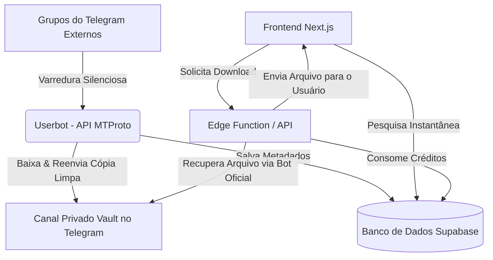

# Roadmap: Telegram STL Global Search Architecture

Este documento descreve as decisões de arquitetura e o histórico de implementação para o recurso de busca global e indexação de arquivos STL em grupos e canais do Telegram.

---

## 🏗️ Desenho de Arquitetura

Para garantir performance e mitigar riscos de segurança (como banimentos da API do Telegram por excesso de requisições paralela), optamos por uma arquitetura assíncrona baseada em **Indexação prévia** e um **Canal de Armazenamento Central (Vault)**.

### 1. O Garimpeiro: Telegram Userbot (API MTProto)
*   **Função:** Um script em segundo plano (Node.js + GramJS) que roda sob uma conta de usuário comum do Telegram.
*   **Ação:** Escuta em tempo real os novos posts em uma lista pré-configurada de canais e supergrupos.
*   **Filtros & Agrupamento:**
    1. Agrupa fotos e documentos de um mesmo post retendo mensagens por **5 segundos** antes de processá-las.
    2. Descarta mensagens sem mídias e arquivos que não terminem em `.stl`, `.3mf`, `.zip`, `.rar` ou `.7z`.

### 2. O Cofre: Canal Privado Vault no Telegram
*   **Função:** Canal privado de controle do administrador da plataforma.
*   **Propósito:** Storage gratuito e ilimitado mantido pelo Telegram. Evita custos altos de armazenamento de arquivos gigantes.
*   **Segurança:** Mantém a cópia do arquivo mesmo se a mensagem original no grupo de origem for apagada.

### 3. Banco de Dados & Indexação (Supabase)
Utiliza as seguintes tabelas principais:
*   `telegram_indexed_stls`: guarda metadados finais indexados (título formatado, tags geradas de palavras-chave, link de fotos, downloads, e ID no Vault).
*   `telegram_scraper_jobs`: registra os logs e estados de downloads ativos, pendentes e rejeitados do robô para acompanhamento do admin.

---

## 📅 Fases de Implementação

### Fase 1: Setup do Canal Vault e Banco de Dados
- [x] Criar o Canal Privado no Telegram.
- [x] Criar as tabelas no Supabase com políticas de RLS e funções associadas (como `is_admin`).
- [x] Criar e configurar chaves secretas e variáveis de ambiente `.env`.

### Fase 2: Construção do Userbot (Scraper)
- [x] Desenvolver o script de scraper usando a biblioteca `gramJS`.
- [x] Criar o agrupador de mensagens por proximidade (5 segundos de buffer de silêncio por usuário).
- [x] Implementar a lógica de cópia de arquivos e fotos para o Vault e indexação no banco.
- [x] Implementar limpeza automática de tags ignorando palavras vazias comuns (stop words).

### Fase 3: Monitoramento, Fila e Aprovação Manual (Melhorias Recentes)
- [x] **Fila Sequencial Global (Queue):** Todos os processamentos rodam em fila de um por vez, evitando esgotamento de banda e CPU do servidor maker.
- [x] **Controle de Tamanho de 1.5 GB:** Arquivos maiores de 1.5 GB são direcionados para o status `pending_approval`. Suas fotos de capa e metadados são enviados ao banco para moderação prévia.
- [x] **Painel de Moderação no Dashboard:** Administradores aprovam (inicia o download na fila) ou rejeitam (muda status para falhou/rejeitado) arquivos gigantes diretamente no painel.
- [x] **Cancelamento Ativo:** O admin pode interromper downloads pesados ou travados no painel. A conexão de stream com a API do Telegram é encerrada de imediato no robô e os arquivos parciais no HD (`.temp/`) são limpos do disco.
- [x] **Anti-Duplicação Silenciosa:** Se um arquivo for repostado com o mesmo nome e tamanho, o scraper detecta a duplicata (esteja já no catálogo ou pendente na fila) e o ignora, não sujando o log. Caso traga fotos novas, ele apenas anexa essas imagens ao registro original.
